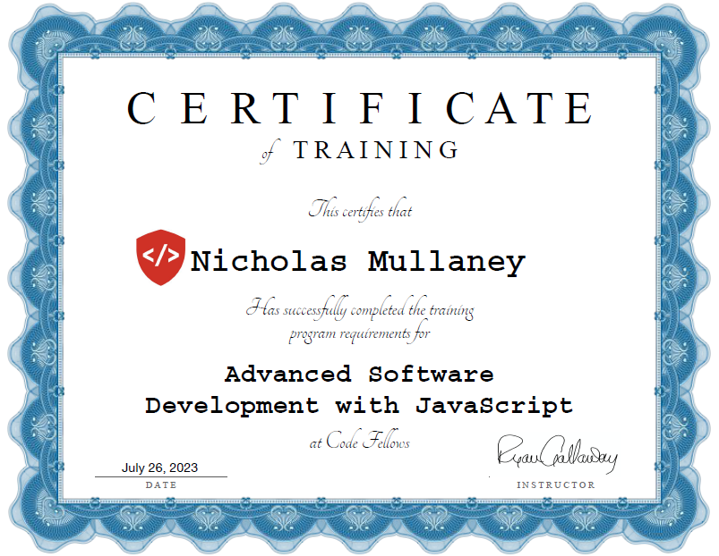

<!-- I have a theory that GitHub does not support the ability to open a link in a new tab. I could only find evidence that it is not possible. -->
&nbsp;&nbsp;
&nbsp;&nbsp;

<h2 align="center">Welcome to my GitHub! </h2>

<h3 align="center" target="_blank" rel="noopener noreferrer"> Check out my <a href="https://nickm-portfolio.netlify.app/">Portfolio</a> </h3>

<h3>🧑‍💻 How I Became a Developer</h3>

I've always been interested and excited by computers and technology. I built my first desktop at 10 and found myself learning to modify code inside of early video games to mod them slightly. I let all of that stay a passion on the side while I went into Culinary to become a Chef. 

I worked in Culinary for 17 years primarily as a Chef, running kitchens with staff of up to 30 in corporate foodservice. I worked at Google for 6 years and had the privilege to reimerse myself in the technology world and found myself wanting more.

The pandemic happened and we were fortunately still employed throughout, but I used that time to think about my path and career options. I took a few classes at a local community college while working and kept finding myself in love with Coding. I signed up for the codefellows Bootcamp while working full time to take my coding career to the next level and am graduating in July 2023.

Now, I am focusing on strengthening my problem-solving skills, practicing data structures and algorithms, building out beautiful websites, and learning more about AI integration. I am continuing to learn as much as I can about the technology industry in an effort to find my forever role at my dream company.  

---------------------
<h3> Code Fellows Certificate</h3>

---------------------

<h3> My Developer Identity</h3>

### I studied **Full Stack Development** at Code Fellows but I have really found true love in **Javascript** and **AI Integration**.  I am attracted to the idea of building out user friendly and accessible websites and applications that are powered by AI. I am currently working on a few projects that are focused on AI integration and looking for more opportunities to work on AI projects.

  - ### 🛠️ **Technologies and Tools**

    - **OS** : Microsoft Windows
    - **Editor** : Visual Studio Code
    - **Languages** : JavaScript(ES6), SQL, CSS, HTML, Markdown, Java, Python
    - **Frameworks/Layouts/Templates** : Next.js, Express, Bootstrap, Jest,
    - **Libraries/Tools** : MERN Stack, Auth0, Jira, Figma, Next.js, Render, Netlify, Git, Github, VS Code, Ubuntu, EclipseIDE, Anaconda,  JSON Web Tokens, Chrome DevTools, Regex, npm, Node.js

  - ### 💎 **Non-Traditional Background**
    #### My journey towards becoming a software developer and software leader has been shaped by my diverse professional experiences. Here's a closer look at two key areas that have contributed to my expertise:

    #### Customer Support & Software Specialist
  
  - In my most recent role as a Customer Support Specialist at MarginEdge, I have had the ability to provide exceptional support to clients in a technical capacity. I leverage my creative problem-solving skills to deliver innovative and effective solutions to make sure that our client base is happy. I have been fortunate to work with our Dev team to understand the intricacies of our software better and even had the opportunity to redesign a page for our web application. We frequently use Jira and Zendesk for problem solving and the team there helped spark my passion for software development.
 
    #### Culinary & Hospitality

    - During my 17 years in the culinary industry, most recently as a Sous Chef at Bright Horizons and BonAppetit@Google, I honed valuable leadership and management skills. Leading diverse teams of up to 30 employees, I successfully managed daily operations and developed systems and standards that are still utilized today. I fostered effective communication and collaboration among team members, creating a positive work environment and promoting teamwork in an oftentimes chaotic environment.
    
    - These experiences have provided me with transferable skills that are highly relevant to software development and software leadership roles. I bring strong problem-solving capabilities, a customer-centric mindset, and the ability to effectively communicate to every opportunity. I really enjoy collaborating with teams across different departments and have the ability to deliver messages to teams of every level of the organization. My leadership experience in managing operations, vendor relationships, and projects demonstrates my ability to take on responsibilities and deliver successful outcomes.
    
    - With this unique background, I am well-equipped to contribute as a software developer and eventually team leader. I bring a diverse skill set, adaptability, and a passion for technology, allowing me to excel in solving complex problems, looking for innovative solutions, and leading teams towards success.

  - ### 🌟 **Professional Competencies**
    - Leadership & Collaboration
      - Effectively communicates within a team and across teams
      - Sets a positive example and influences others
      - Works tenaciously to deliver on commitments
      - Constantly seeks bigger challenges
      - Holds oneself and others accountable
    
      - Communication
        - Ability to deal with ambiguous situations and solve problems with agility
        - Envisions beyond the responsibility of their role
        - Builds a career across multiple disciplines
        - Attends every opportunity to learn and grow professionally
        - Embraces personal growth as a better human being

      - Growth Mindset
        - Empowers every person to achieve more
        - Encourages communication and influences others
        - Supports and uplifts individuals from non-traditional backgrounds
        - Creates a safe working environment for everyone
        - Engages in community outreach through volunteering

  - ### 🌈 **Why I Want to Work in Tech**
    - I want to contribute to the future of technology to aid and assist others.
    - I am ready for a liveable wage, excellent healthcare and rewarding benefits.
    - My ability to adapt allows me to change my professional career.
    - I am a lifelong learner looking to keep life interesting.
    - I recognize that software and technology is the future.
    - The queer developer community is welcoming and supportive.
    - I want to aid and empower other queer & neurodivergent people.
    - I want to help make the world a more accessible place for everyone.
    - 

  - ### 👭 **My Favorite Organizations**
    - Coming Soon

---------------------
<h3>✍️ What I'm Working On</h3>

  - Dungeons & Dragons OpenAI and Dalle integrated application to quickly create characters and world settings for Dungeon Masters and Players.
  - Store Homepage for a Spice Company with operating shopping cart and checkout.
  - Helen House website and backend database for a local non-profit.

<!-- ---------------------
<h3>💡 What I'm Learning</h3>

  - Coming Soon

---------------------

 -->

<!-- ---------------------
<h3>🎟️ Events I'm Attending</h3>

  - Coming Soon

--------------------- -->

.png>)

---------------------

<h3>📻 My Favorite Coding Playlists</h3>

  - [Lofi Nature Playlist](https://open.spotify.com/playlist/0cA0sXu2h1UmetXJyMofaH?si=e74fb3bc927548e6)
  - [Coding Wizard Beats](https://open.spotify.com/playlist/6hFF6QKqq4rZQ7PLaxR4wZ?si=bf1cadf03a374f2d)
  - [Tool Playlist](https://open.spotify.com/playlist/6PlkPjoQ4PVxTjaDI19pLn?si=d96a4357f8b041aa)
  - [Budos Band Playlist](https://open.spotify.com/playlist/37i9dQZF1DZ06evO3bJRdu?si=5775a2d0b8334d1a)
  - [Lofi Nerd](https://open.spotify.com/playlist/1yfYJAnEushmdQxOtKTmRK?si=6a3cfe536a8842f7)
  - [Synthwaves from Space](https://open.spotify.com/playlist/4sgUux9hmykyWYmVoe4W6p?si=a800c565a2574bdd)
  - 

<!-- --------------------- -->
<!-- <h3>👭 What I'm Contributing To</h3> -->

---------------------
<h3>👽 Fun Facts</h3>

  - Dungeon Master for over 20 years
  - Blacksmith/Leatherworking as crafting hobbies
  - Currently writing a fantasy series
  - Love to garden and grow my own food
  - Hiking and Backpacking are some of my favorite activities
  - Love Board Games, Video Games, and Puzzles, especially Escape Rooms
  - Love going to live music shows and the symphony
  - Won an award for customer service at Bon Appetit out of 300,000 employees across the country

---------------------

<footer>
<h3>📚 Resources Used to Build This Repo:</h3>

- Header from <a href="https://www.canva.com/">Canva</a>
- Social media favicons from <a href="https://icons8.com">Icons8</a>
- <a href="https://towardsdatascience.com/build-a-stunning-readme-for-your-github-profile-9b80434fe5d7">Build a Stunning README For Your GitHub Profile</a>
- <a href="https://sarah-hart-landolt.medium.com/6-easy-steps-to-create-a-beautiful-github-profile-readme-edc7840b2c7">6 Easy Steps to Create a Beautiful GitHub Profile README</a>
- <a href="https://docs.github.com/en/github/setting-up-and-managing-your-github-profile">Setting up and managing your GitHub profile
</a>
</footer>